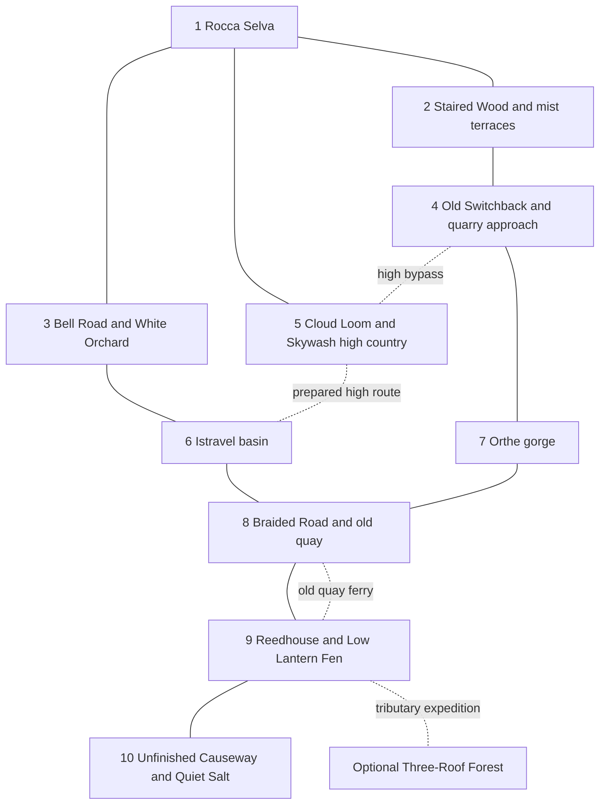

# Regional map v0.1 — roads, watersheds and reasons to wander

**Active working draft.** This connects the [Atlas](Atlas.md), [first region](../02%20Narrative/First%20Region.md) and [atmospheric briefs](Atmospheric%20Frontiers.md). Geography, distances and placements remain proposals, independent of Bellwater's layout and the supplied reference map. No map implementation is commissioned.

The journey runs from **Rocca Selva through Bell Road or Old Switchback, into the cities in either order, through the Braided Road/Reedhouse connections, and eventually to the Unfinished Causeway junction**. Reedhouse can be visited after either first city, before crossing to the other. Returning home remains geographically plausible throughout.

## Ten core zones and their links

Solid links are ordinary road/water connections; dotted links are optional alternatives. Both directions remain usable unless a quest changes them. Reedhouse's two approaches occupy different banks, so one disrupted crossing need not strand the campaign.

| Zone | Sights, activity and why it is fun | Creature relationship loop |
|---|---|---|
| **1. Rocca Selva** | Limestone contours, work spilling onto landings and distant routes between roofs. Two loops reward shortcuts, family visits and games. Woodland, trade road and exposed saddle offer distinct departures. See the [town brief](Rocca%20Selva.md#spatial-brief-v01-a-town-wrapped-around-its-work). | Learn an individual's preference through shared work. Bellwether, Thimbleback or another reviewed partner can begin the relationship; no compulsory species unlocks departure. |
| **2. Staired Wood / mist terraces** | Walls support rising canopy paths. Learn a gathering circuit before fog obscures it; follow nuts, hop a dry channel or reach a song above the trees. The mist hamlet occupies a sheltered western side valley. | Useful Thimbleback exchanges; readable Vergecat boundaries; Cragmantle seep signs. Observation can reward a visit without forcing combat. |
| **3. Bell Road / White Orchard** | Bright shoulders descend east through mineral-grown hollows. Trade shelters and a streamside footpath reach the same exchange. Climb fallen shelves, compare tiny pools and watch migrating animals redirect traffic. | Help clear a Glassgrazer feeding obstruction; revisit without breaking living formations. Brackenstride nursery signs offer a separate detour. |
| **4. Old Switchback / quarry approach** | Cool ravines, refuge cisterns and stair markets. A pack road and longer contour bypass rough steps. The Cairn of Many Hands fills a side quarry above the gorge with hospitality and extraordinary sculpture. | Trace Cragmantle grip marks to a protected overhang. Habitat work can earn a keeper introduction; finding eggs grants no ownership. |
| **5. Cloud Loom / Skywash** | Keeper food and breeding veils on the early shoulder; pasture, seasonal Thaw Stair and exposed traverse farther on. Borrow traction gear, read wind and find a lunch ledge overlooking roads already travelled. | Respect Kitefin roosts; distinguish Sailrook nest boundaries from Vesperveil's sheltered gullies. Guides and equipment keep the route possible without owned flight. |
| **6. Istravel basin** | Inhabited terraces beneath suspended water. Follow a working circuit from nursery to garden to market, with playful water gates and public demonstrations. Useful wonders precede investigation of control. | Meet Ribbonwake and pollinator needs. Caretaker introductions can lead to partnership; civic working creatures are not unattended capture targets. |
| **7. Orthe gorge** | Broad stair courts, counterweights and seed halls. Take a public lift or workshop stair; challenge an apprentice or reach a quiet pool beneath the city's noise. | Observe Gorgecoil in oxygenated side pools; restore passage around a screen before approaching. Ordinary public routes remain available without creature powers. |
| **8. Braided Road / old quay** | Ferries, raised causeways and mobile gardens. A bypassed freshwater quay holds a repair shop and evening chorus. Cargo ferry and levee walk meet different people and rejoin downstream. | Help a Reedbarque bank crossing. Doorling investigation can sit beside the quay's present work without turning every resident into a relic. |
| **9. Reedhouse / Low Lantern Fen** | Red reeds, accessible dwellings, dry walkways and piloted boats. Dusk moths reveal lee banks and a night market; lower water opens a loop through former gardens. | Habitat work culminates in Morrow Moth spectacle. Reedbarque partnership rewards care, while hired ferries reach required shores without exhausting breeding populations. |
| **10. Unfinished Causeway / Quiet Salt** | Misaligned road extensions, picnic shelters and toll rooms border a dry terminal basin. Later surveys reveal the shared junction beneath familiar works. Read tracks and cross immense light toward stone shelter. | Observe uncaptured Knuckle Saints; identify Velvet Undoer material traces. Animal habits support investigation without becoming infallible truth detectors. |

## Water and climate that connect the places

Rocca stands near the watershed divide, below the highest catchments. Western streams descend through the mist terraces and Orthe's gorge; eastern runoff passes the White Orchard into Istravel's basin. Both drain toward Reedhouse, carrying the consequences of upstream extraction and maintenance. Beyond the confluence, braided channels spread into the Quiet Salt's terminal basin. Evaporation concentrates salt there; Reedhouse remains freshwater, and Reedbarques cannot simply be relocated into brine.

Skywash has cold winters, seasonal snow and sheltered thaw pockets. Moist western slopes support chestnuts and mist; sunny lower terraces support warmer crops. Quiet Salt lies beyond a low ridge in a rain shadow, its wetlands sustained by incoming rivers rather than abundant local rain.

**Optional warm frontier:** Three-Roof Forest occupies a sheltered valley on a southeastern ridge's moist-facing slope. Warm air from beyond the map supplies sustained rain; its tributary joins Reedhouse upstream of the salt flats. A separate boat-and-foot expedition passes visibly changing vegetation. Ground, middle branches and sunlit crown host the [beacon expedition](Atmospheric%20Frontiers.md#the-three-roofs-of-the-forest), a keeper station and territorial wildlife. This is separate from the Apennine chestnuts; botanical communities need further development.

## Gates that create anticipation, and routes around them

Three near-home loops open without mandatory combat. Full Skywash initially requires a weather opening and route briefing; Cloud Loom's shoulder stays available. Caravans, guides and maintained paths permit travel without owned mounts. Service schedules follow announced journey stages; reading dialogue cannot secretly miss a ferry.

The lower circuit avoids retracing the mountains. Old quay's ferry and the raised bank reconnect at Reedhouse, introducing the Confluence after either city. The other city remains reachable before a late junction commitment. Travel requires no ideological pledge.

The causeway fringe can be visited earlier for picnics, tracks and small discoveries. Its central crossing becomes a late expedition when the campaign supplies tested routes, consent and rescue preparation. Preserve two physically distinct retreats: an elevated dry service passage toward the old toll rooms and a staffed river landing toward Reedhouse. A bounded pursuit can separate companions and create a rescue objective without turning every wilderness detour into mandatory permanent loss.

## Returning should change the view

Repaired springs change downstream pools; an old-quay trader appears in a city market; Lina's sign welcomes the player home. Revisits reveal behaviour, weather opportunities and conversations without filler battles. The author knows this topology; the player's map records explored branches and reliable learned directions.

Smooth jumps and rolls should enliven forgiving ledges and woodland routes without replacing walkable approaches or selecting real-time combat. Review the opening walk, intercity circuit and late retreat as distinct experiences.

[Atlas](Atlas.md) · [Rocca Selva](Rocca%20Selva.md) · [Atmospheric Frontiers](Atmospheric%20Frontiers.md) · [Story Architecture](../02%20Narrative/Story%20Architecture.md)
