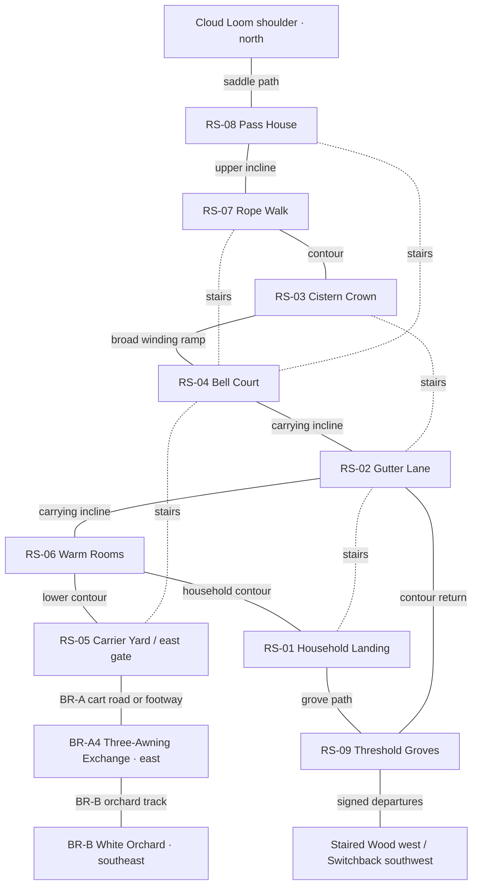

# Rocca Selva — detailed atlas for the first five hours

This spatial companion to [First Five Hours](../02%20Narrative/First%20Five%20Hours.md) extends the original [Rocca Selva](Rocca%20Selva.md). New measurements, buildings and events remain draft. The central contract owns main quests; [Residents and Side Stories](../02%20Narrative/Rocca%20Residents%20and%20Side%20Stories.md) owns personal scenes; [Opening Creatures and Commerce](../03%20Game%20Design/Opening%20Creatures%20and%20Commerce.md) owns invitations, services and prices. [Opening Battle Encounters](../03%20Game%20Design/Opening%20Battle%20Encounters.md) owns battle fixtures and the optional wild cache encounter. This page supplies their physical places.

## The village at human scale

The settlement has **84 permanent residents in 28 households**, occupying 26 domestic or mixed-use roof groups, three workshops/storage buildings and five civic buildings. Some households share a roof. Twelve interiors are explorable; other homes have inhabited thresholds, delivery hooks and windows. The village serves the surrounding terraces.

Road-opening day brings roughly forty visitors from nearby hamlets, six pack animals and three trading vehicles across the journey phases. They bring herb bundles, repaired tools and reasons to stay for supper. These are fictional population figures, not simultaneous rendering requirements. Many neighbors simply live here without offering quests.

Warm grey limestone, dark roof slabs and chestnut joinery frame bright repaired cloth. Polished steps and patched retaining walls show use. A roof garden hides part of the tower from home; emerging beneath the schoolroom reveals its height. Bread, laundry, ringing metal and conversations invite approach.

### Coordinate and route ledger

Coordinates are **metres, x east, y north, h above the eastern gate**. Bell Court is `(0,0)`; coordinates locate landing centres. Preserve connections and relative heights when adapting the roughly 240-by-230-metre core. Groves extend beyond it. No river crosses the hilltop.

| District | Centre `(x,y,h)` | Principal connections |
|---|---|---|
| RS-01 Household Landing, Chestnut Steps | `(-62,-67,7)` | Gutter Lane uphill; Warm Rooms along contour; Threshold Groves downhill |
| RS-02 Gutter Lane | `(-36,-23,14)` | Home, Bell Court, carrying incline; short cistern stair |
| RS-03 Cistern Crown | `(-8,41,26)` | Bell Court ramp, Gutter stair, Rope Walk |
| RS-04 Bell Court | `(0,0,18)` | Gutter Lane, cistern, Carrier Yard stair, Pass House stair |
| RS-05 Carrier Yard | `(67,-27,3)` | East gate, Court, Warm Rooms, Bell Road |
| RS-06 Warm Rooms | `(2,-73,6)` | Home, yard, carrying incline |
| RS-07 Rope Walk | `(37,65,29)` | Cistern, Pass House, intermediate Court stair |
| RS-08 Pass House | `(72,85,27)` | Rope Walk, Court stair, incline; north saddle beyond |
| RS-09 Threshold Groves | `(-107,-97,-3)` | Home and Gutter return; Staired Wood west, lower Switchback southwest |

This diagram shows adjacency; use the coordinate table for orientation. Solid links are walking/carrying routes; dotted links are shorter stairs.

The **carrying incline** starts at the east gate `(101,-30,0)`, passes Carrier Yard, bends south beside the bakery, then west toward the household contour. It turns uphill beneath Neri's parcel porch, reaches Bell Court and curves around the cistern's eastern buttress to Rope Walk and Pass House. About 400 metres of actual winding route absorb the 27-metre rise. Typical stretches rise 1 in 12–18; short flatter landings interrupt them. Do not connect the coordinates with steep straight ramps.

The incline is 2.4–3 metres clear, with 4.5-by-5-metre turning landings. Two people can carry a folded table; others pass at landings. Small handcarts use it; trading wagons stay in Carrier Yard. Doors, baskets and cloth ties leave the carrying line clear.

Stairs shorten home–Gutter, Gutter–cistern, yard–Court, Court–Rope Walk and Court–Pass House. Landings offer handrails, views and sitting edges. Optional root jumps land on lower paths; required destinations need no jump or particular creature.

**Paper walk estimates:** home–yard via Gutter/Court, 3–4 minutes; home–Warm Rooms, one; yard–Court stairs, 1–2; Court–Pass House, two by stairs or 3–4 along the incline. The lower loop takes 7–9 minutes without conversation; the upper, 5–7. These assume 60–75 metres per minute while looking around, not a selected movement speed or measured build. Interaction supplies the longer visit.

## RS-01 — Household Landing, Chestnut Steps

### RS-I01 — Ada's home and workroom

A 7-by-9-metre shared-wall house opens east onto the apron. Its ground floor has a living/work room, a narrow cooking room behind and a screened washing recess. A stair along the uphill wall reaches two sleeping rooms: Ada and Nella share one; the older children and protagonist use the other with curtains and shelves. It is crowded without being destitute. The rattling shutter faces the valley; no suspicious locked paternal room is implied.

From the door, see Ada's harness and the good shirt. During packing, inspect Tobin's inaccurate feet, Lina's lettering and Nella's borrowed scarf. A rear door reaches a level passage back to the apron. Ada works here until her authored market move; contract review remains available here if the market was skipped. Evening changes the table arrangement and each child's occupation.

### RS-01b — The shared threshing apron

A 12-by-8-metre platform serves three households. Nella's chalk course occupies the dry side; the turning area stays clear. Join a round, dispute her new rule or watch a neighbor shake a rug. Losing changes commentary, not wages or affection. Ada's optional table story takes place at Bell Court; no borrowed school furniture is silently relocated here. Its household consequence is a cleared worktable inside.

### RS-01c — The lunch rail

A covered seat ten metres along the lower path overlooks western terraces. A wide path returns home; a low edging stone offers a harmless hop. Compare lunches, show Tobin a sketch or look toward Thimbleback caches. Evening lamplight reaches the rail from home.

## RS-02 — Gutter Lane

### RS-I02 — Ruskell's chair room

Ruskell's 5-by-6-metre front room opens under a shallow bridge between two houses. There are three chairs under repair and one he forbids anyone to improve. A bright back window reveals the lower gardens. Move around the bench, compare a repaired joint with the loose one, or listen while neighbors offer contradictory advice. All useful objects are reachable from floor level. The back domestic door is private; the public exit remains visible behind the workbench. Ruskell can join Dema later without leaving the player trapped or his service secretly unavailable.

### RS-I03 — Charcoal loft and roof garden

An outside stair reaches a 4-by-7-metre former charcoal loft; an incline spur reaches its rear landing. A drying screen partly conceals the entrance, but hanging pots suggest occupation. Asking opens an invitation without a commission prerequisite.

The second door opens onto an 8-by-6-metre garden with parapet and trellis. Old initials, Ada's teenage painting and a surviving bench support the rooftop story. Dema brings portable herb trays when that story places her here. A return stair rejoins the lane above Neri's shop.

### RS-I08 — Neri's shop and parcel room

Neri's 6-by-8-metre shop faces the upper half of Gutter Lane. The front room holds ordinary travel goods in shallow shelves, with a broad central aisle and counter to the right. An open side doorway exposes the parcel room: labeled pigeonholes, a wrapping bench and two waiting stools. The rear porch meets a carrying-incline spur, so freight never squeezes through browsing customers.

Compare a strap, buy from the commerce page's stock, post an agreed letter or inspect a misplaced label under Neri's supervision. The local unattached Doorling visits the porch; it is distinct from Tavio's familiar animal. Public and private parcels are visually separated. The associated story does not authorize indiscriminate reading of mail. When Neri steps into the rear room, a counter bell calls her back; there is no hidden shop-closing timer.

### RS-02c — Four-Spout Passage

Four roof spouts feed rain barrels beside a chestnut trunk, separate from drinking taps. A Thimbleback caches on the dry side of a retaining drain. Inspect, take the parallel path or follow husks toward the groves. A tied-back sheet reveals the familiar side latch; once discovered, it stays usable on returns.

## RS-03 — Cistern Crown

### RS-03a — Public trough and inspection lip

The protected cistern occupies a rock recess above Bell Court. A covered drinking channel enters from the north catchment; water is visible through an inspection slit before reaching two public taps. A bucket shelf and low accessible tap sit on a dry level apron. The overflow goes into a separate open channel, not back into supply.

Here the survey records **public access, visible flow and the actual condition of the outlet**. Behind a low fence, a leaf-clogged grate drains local tap-apron splashes and rinsing water into the downhill waste channel. This is the opening script's separate wash-water outlet, not the drinking intake or water traveling uphill from the Warm Rooms. It can be noted without repair. Nobody must buy a container, own a creature or shut household water to receive the observation. Looking through the slit explains why the supply can remain adequate while that outlet is troublesome.

### RS-I04 — The waterkeeper's room

A 4-by-5-metre room opens beside the trough and toward Rope Walk. Measuring rods, a service board and a stool leave room to turn a carrying frame. Compare marks and maintenance notes; the board supplies practical information when the attendant is away. A sign points along Rope Walk to optional practice at Pass House, RS-08b.

### RS-03c — Breeding-shade rail

A planted shelf behind a rail shelters moss and small insects. Watch a child count reflections or guide a browsing animal around the busy trough. The fence prevents trampling. Following runoff toward the lower settling beds reveals the town's height and separate water routes.

## RS-04 — Bell Court

### RS-04a — The awning market

The court is an irregular wedge about 22 metres long and 12–18 wide. Six folding stalls occupy wall edges, leaving a three-metre route between the yard stair and cistern ramp. Dema's herb bundles sit downwind of the baker's tray. Tavio keeps only light samples here; his heavy stock stays in the yard. Ada's temporary worktable stands under the schoolroom awning where a laid-out harness can be seen from the walking route.

The fair draws terrace households who could not sustain permanent shops. Smell or inspect Dema's samples, compare traveling fabrics, ask who is hiring, or simply watch a purchase. Ada reviews Pell's actual terms here in one short conversation. It is not a second acceptance office. Evening stalls fold back into a performance edge and shared eating tables; unfinished transactions remain available through the commerce page's stated service fallback.

### RS-I05 — The schoolroom

A 9-by-7-metre room opens through double doors onto the court. Broad shutters face the same space, making a lesson or rehearsal audible without forcing entry. Two folding table sections, three bench rows and a raised reading corner can be rearranged by the people using them. A side door joins the cistern ramp, creating a second way out during a crowded performance.

Lina's credited schedule hangs beside the door. For The Longest Table, an approximately eighteen-metre service-ramp approach runs from the side door around the awning corner to Ada's adjacent market position. Its turning landing makes setting down and changing grip useful; the route never descends to Carrier Yard. Alternatively, Ada brings her rolled cover and tools into the window-side strip. Sit through a lesson or correct a silly sign with Lina. The chosen arrangement leaves either table outlines or a visible shared work strip, with rehearsal passage preserved.

### RS-I06 — Tower base and practice gallery

The tower base contains a 5-by-5-metre public room with an open stair to a low practice gallery. Hand bells hang separately from the working ropes, so trying Nella's rhythm cannot accidentally signal an emergency. A side door exits beside the market's quiet edge; the gallery has railings and a clear view back to its stair.

Mara explains a civic signal or lends a chime. Nella wants to attempt her own rhythm. The working upper chamber stays behind its latched gate. When Mara moves to practice, her board names the Pass House loading court.

## RS-05 — Carrier Yard

### RS-05a — Weighing porch and east gate

The gate is a long roofed porch. Its 20-by-16-metre yard has a ten-metre clear turning area and two unloading faces. A low route board points toward both cities and the Bell Road exchange. A foot lane behind the weighing bench stays open during arrivals.

Tavio's narrow wagon arrives from the east, stops under the outer awning and backs into one berth only after its turning lane is clear. Cloth, the creature beside it and the awkward arrival explain why a player might approach. Helping is optional; Tavio can point toward Pell regardless. Pell's survey table begins beside the board and moves visibly to the exchange after acceptance, leaving a dated direction note. Pavo can handle seated checking tasks here or at the exchange when the main script places him there.

### RS-05b — Quiet ramp and sound-rock apron

A broad, shallow practice plank joins two low loading platforms beside the wagon berths. A ground path around it provides the quiet alternative for Clatter. Spectators stand outside both routes; resolving the crowd does not require winning combat or occupying the only exit.

Along the wall, an owned Cragmantle braces a hauling line on sound limestone. Handlers balance the load. Ask to observe, compare its tapping with loose rock or offer room. Feed and shade are nearby. This working animal is unavailable for recruitment.

### RS-I07 — Bera's repair bay

Bera's 8-by-9-metre bay opens directly into the yard through a three-metre working door. A public tool counter stands on the cooler side; the hearth and hammering block occupy a bounded rear corner. A side pedestrian door leads to the Warm Rooms path, so visitors need not squeeze behind a moving cart.

Bring a repair request, compare bent and replacement pins or join the cart comedy. When the cart moves outside, it exposes Bera's sketch of an ambitious folding chair. Evening banks the hearth; the counter remains callable from the doorway.

## RS-06 — Warm Rooms

### RS-I09 — Ollo's bakehouse

The 7-by-9-metre building has a front bread room, a screened preparation room and an oven recess opening onto a small fuel court. Customers enter from the Warm Rooms path; flour and fuel arrive from the Carrier Yard side. The public counter reveals bread coming out without inviting the player to stand inside an active oven mouth.

Buy food, compare traveling loaves or watch Ollo negotiate with an Embermole whose cool nook is separate from the oven. A back door leads to the drying court. Evening closes half the display but leaves a signed serving hatch for pending interactions.

### RS-I10 — Sela's Warm Rooms and guest loft

A changing vestibule leads left to the washing room, straight to the warm gathering room and right to Sela's small office. The office has a low counter and service slate visible from the entrance. The bath has privacy screens and an empty usable changing corner; no quest requires approaching undressed residents. Beyond the gathering room, a cool threshold opens onto the creatures' undisturbed refuge and outdoor court.

A covered entrance from the yard path serves the guest loft above the office without crossing private rooms. A level guest alcove sits beside the gathering room. The complex spans roughly 14 by 12 metres beneath connected low roofs.

Use covered lodging, dry gloves, meet a traveler or help Sela compare refuge choices. Commerce owns services and invitation conditions. Two exits remain apparent: vestibule and court. Evening brings shared conversation.

### RS-06c — Drying court and settling beds

An open 13-by-10-metre court holds rotating drying screens, laundry troughs and two sitting benches. Open a screen to catch light or help someone recover the cloth hung on the wrong side. Used wash water runs visibly downhill into reed-and-gravel settling beds below the court; it does not magically become drinking supply. A low rail separates the beds from play space. The level path west reaches home; east reaches the yard, giving the player's first useful return loop.

## RS-07 — Rope Walk

### RS-07a — Cloth pegs and harness tables

A 45-metre upper walk alternates sheltered work bays with open sky. Long ropes rest on pegs at hand height; repaired harnesses occupy benches, not the walking strip. Miret's practice cloth shares this space under an actual borrowing agreement. Retie a loose corner, compare a knot with a shown example or watch the apprentices discover their weather imitation is mistimed. These acts lead into the cloth side story without making rope craft a new system.

### RS-07b — The wind turn

Cloth reveals a crosswind around bare rock while the inside wall stays calm. A sitting step faces the first Bell Road bend; stairs return to Court. A dropped object lands on the reachable shelf. Loaded handcarts follow the sheltered inside.

### RS-07c — The lee perch

A stone lip catches warm air beside a damp sheltered crevice, visible from path and inspection landing. Follow the Kitefin's cloth behavior, then watch its landing corrections. No egg removal or immediate capture follows. Opening Creatures owns today's availability; the later roster's invitation is not active here yet. Revisit after resolving the cloth story.

## RS-08 — Pass House

### RS-I11 — Common room, beds and equipment stores

Three thick-walled rooms fit an approximately 11-by-13-metre building. The south entrance leads into a common room with a stove, tea bench and route board. A broad right-hand door reaches communal beds; a left doorway reveals stretchers and borrowing shelves. The north weather porch provides a second public exit toward the saddle.

Try a walking pole, inspect the marked return shelf or speak with a traveler whose route differs from yours. Emergency bedding is not somebody's saleable inventory. Main-commission tools can be borrowed free under the central contract. Mara's practice information remains available when she is outside. The high-country notice distinguishes the currently open shoulder from the full Skywash traverse, avoiding a fake promise of unrestricted early access.

### RS-08b — Loading and practice court

A 14-by-10-metre walled court has a carrying lane along one edge and a marked practice patch beyond it. Borrowed partners enter from the shaded holding bay; visitors watch from the porch. A match never blocks the route board or equipment room. Mara can conduct the optional one-partner lesson and restore the practice pair afterward. Creature cards, rewards and retry rules are owned elsewhere; the geography merely supports a clear invitation and an equally easy departure.

### RS-08c — Public rest ledge

Thirty metres beyond the north porch, a 10-by-8-metre ledge faces the saddle. A visiting keeper's Sailrook lands outside the village streets, with room for all four wings and a clear approach. A rail separates public watching from the resting animal. Its keeper can demonstrate a dropped-object catch or explain weather closure. Seeing it creates anticipation for later travel; owning it is neither available nor required. The onward north path leads toward Cloud Loom, never east to the White Orchard by accident.

## RS-09 — Threshold Groves

### RS-I12 — Chestnut drying shed

A 6-by-10-metre shed has a level downhill entrance and a wide uphill loading door. Low drying racks surround a central aisle; a raised sleeping shelf belongs to a seasonal worker, not another collectible room. Compare good and damaged nuts, inspect tracks or leave a permitted offering outside the racks for observation. The Thimbleback encounter's exact invitation conditions remain on its creature card. A second door opens onto the Gutter return contour, so visiting does not require retracing the entire grove.

### RS-09b — Stool-wall overlook

Old coppiced chestnuts grow beside a retaining wall with stone seats. From here, the household shutter and drying court can both be seen. Tobin's observation conversation can distinguish a copied drawing from something the player watched. This is the public woodland edge: workers and baskets remain present. A lower path returns to the drying shed, while a signed western path continues toward the Staired Wood.

### RS-09c — The old charcoal platform

A circular level patch sits beyond the last worked terrace, reached by a broad dirt path. Charcoal traces, a repaired fence and an ordinary picnic board give the place a history before danger. A distant Vergecat glimpse can occur beyond the marked livestock boundary without initiating combat. Watch, ask a worker or return. The lower southwest departure points toward the Switchback; the first-five-hours package does not turn this optional view into a required wilderness chase.

## Two Bell Road corridors

### BR-A — Gate to Three-Awning Exchange

The winding eastern road travels 700–900 metres to the exchange, 35 metres below the gate. The bright upper cart road and lower streamside footway meet there. Allow 10–14 minutes without scenes, less on familiar returns. The stream gathers runoff downhill from Rocca. Stable landmark IDs are not walking order: the outward sequence is **gate → BR-A1 Upper Bend → BR-A3 Strap Shelter → BR-A2 Wind-cut Bend → BR-A4 Exchange**. Shelter and marker approaches connect to both public routes, keeping Vela's introduction between the two marker readings.

- **BR-A1, Upper Bell Road Bend:** a flat pull-off after the first long descent contains the first marker, visibly numbered 14. Its public face can be read from level ground. A short spur joins the footway, so choosing the lower route does not permanently lose the observation.
- **BR-A2, Wind-cut Bend:** farther east, the second marker also reads 14 while the supplied sheet expects 16. A loose plank has a supplied fastening beside it. Inspect, secure it, ask for help or take the broad marked bypass; recording its unsafe state is sufficient for the survey. The longer route and inspection approach rejoin before the next landmark.
- **BR-A3, Strap Shelter:** between the two inspected bends, a three-sided shelter overlooks the footway junction. Vela's luggage-seed mistake fits beside the bench and pack rail. A dry patch, route board and return-facing view support her public introduction independently of any booking. On the downhill side, a clearly optional twenty-five-metre spur leads toward paired chestnuts; the public road continues visibly past its entrance.
- **BR-A3a, Paired-Chestnut Lookout — F5-B04 / RS-C10:** the spur bends past an observation rail to a six-by-eight-metre sitting shelf overlooking passing caravans. A broad inside verge provides a peaceful line around the cache when the animal gives space; there is no jump, toll or required survey reading beyond it. Before the bend, husks and discarded bright washers reveal a wild Thimbleback's cache under a loose stone. Its short clod-throws and folded cups can be watched from the rail. No proximity trigger starts combat. Wait, offer the permitted ordinary pebble and step wide, return to the public road, or explicitly challenge with an owned standing companion. Victory opens the lookout for this visit; withdrawal returns to the rail; defeat recovers the party at the shelter with inventory and observations intact. This individual is not the recruitable RS-C02 animal and cannot be recruited here. The encounter's exact choices, battle terms and repeat behavior belong to [Opening Battle Encounters](../03%20Game%20Design/Opening%20Battle%20Encounters.md#f5-b04--rs-c10--the-owner-of-the-short-path); the main road remains unaffected in every result.
- **BR-A4, Three-Awning Exchange:** one low **red-tile main roof with three cloth awnings** shelters the scale, report table and meal/unloading bench around a 24-by-18-metre yard. Its red roof is visible from both approaches. Asta manages the space; Pell's matching sketch identifies their table. Pavo checks straps and manifests from a seated bench. Jori's basket audience occupies a side bay outside the wagon path.
- **BR-A5, Lower Relay:** a 90-metre cargo spur descends six metres below the exchange to a 14-by-11-metre turning/loading shelf, joining the cart road before the footway junction. An upper rest overlooks the turn and catch apron, one metre below the shelf. The holding cleat and hand winch stand at the upper rest; the chock sits inside the curve and the turning rope uses an upper stone post. A safe contour reaches the catch apron; earth banks prevent a cliff fall. A pedestrian stair returns to Asta's bench. This is Tavio's booking workspace, not another report destination.

Pell receives the report here. The two optional bookings are offered here, with their terms visible and a distinct departure confirmation. Tavio's handling branch remains around the exchange and its return-loading shelf. Neither reading menus nor wandering advances the work window. A public return path is always available. Asta can explain where a temporarily relocated person has gone without requiring the player to search every awning.

### BR-B — Exchange to White Orchard

The orchard branch descends southeast from the exchange for roughly 450–600 metres to the first mineral hollow. It remains on the eastern watershed toward Istravel, not a shortcut through Orthe. The route has three linked places and a walking return; ordinary access does not imply earning Pell's booking payment twice.

- **BR-B1, Split-Branch Track:** a fallen chestnut divides a straight carrier track from a curving footpath. Cut ends and intact living mineral deposits clearly differ. A low walk-through gap makes a playful shortcut; the main track fits a carrying frame.
- **BR-B2, White Orchard Listening Shelf:** a stable rock shelf overlooks Glassgrazers, their rubbing stones and tiny deposit pools. Pell's demonstration and Vela's substantial field scene can stand side by side without disturbing the feeding corridor. Ordinary visitors can observe from the same public edge without receiving the booked assignment.
- **BR-B3, Mineral Canopy Walk:** a maintained footway climbs between fallen mineral shelves to a broad fixed landing above the hollow. Beside it, a short, attended inspection cradle travels on an existing hauling line to the same station; choosing the footway avoids the moving cradle. The station includes a substantial suspended work platform, a fixed stone refuge, Pell's vane mounting and a sheltered writing table. From its rail, Rocca's tower lies back uphill and Istravel's distant channels appear toward the eastern basin. Sound stone and handrails carry the required walking route; optional low hops land safely beside it. The longer ramp reaches the fixed landing. A catch-line can draw the gust-blown proof sheet inside the station rail; a service ramp also reaches a broad ledge one metre below the platform for the alternative recovery. Neither route crosses living mineral fans or requires a companion. [Two Bookings Script](../02%20Narrative/Two%20Bookings%20Script.md#f5-m05-p3--the-sky-under-your-feet) owns the actual alignment, recovery actions and dialogue. Creature invitations remain separate from operating this worksite.

The two paths rejoin at the Listening Shelf. Returning reveals the exchange from below, then the distant tower between roofs. Reserve conversation and observation time here rather than extending the path with anonymous fights. Completing either booking reconverges on the evening return; the household is not relocated to the road for convenience.

## Caravans, animals and a market that could work

Wagons stop at the east gate; handcarts redistribute along the incline. Tavio brings paper, cloth, salt, medicines and tools; Neri receives parcels and Bera checks repair pieces. Return cargo includes chestnuts, herbs and repaired coverings. He combines consignments from Istravel and Orthe without relocating their separate regional approaches.

Ordinary mules or ponies wait at an outside hitching station beside the gate with water, shade and room to turn. Existing fauna references support ordinary pack animals; they are not a newly invented collectible species. Passenger carriages exchange passengers at the yard rather than appearing upstairs. The northern saddle remains for guided high-country departures. Westbound loads use the grove/Lower Switchback approach or agreed regional routes, not a fictional western continuation of Bell Road.

Arrival proceeds visibly: stop, clear the turn, settle the animal, block the wheel, lower a board, count and redistribute. People continue if help is declined. Loads are checked before explicit booking departure. Folded awnings, outgoing stacks and receipts show completed trade. Pavo's injury changes who lifts; seated manifest work preserves his competence.

## RS-E events — unexpected, visible and bounded

These are encounter placements, not extra quest gates or random timers. An event remembers its resolved presentation and does not repeatedly award items. Personal outcomes remain with their F5-S or RS-C owners.

| ID / trigger | What happens and what the player can do | Outcome, return and reset |
|---|---|---|
| **RS-E01 — Morning Arrival, first sight of Carrier Yard** | Tavio's awning brushes the wagon's top basket while Clatter refuses the noisy plank. Watch, ask what is stuck, create quiet space or use the open foot lane. | Tavio remains approachable either way. His crew completes arrival by Contract Accepted; the creature invitation follows RS-C01. Reopening the area never replays a fresh collision. |
| **RS-E02 — Morning Arrival, Four-Spout Passage** | A test pour sends rain-barrel water onto Ruskell's empty advice chair. Warn him, shift the empty chair with permission or enjoy his commentary. **Ruskell:** “That chair has survived three roofs. It ought to know better.” If offered help: **“Beside the post, please. Even advice needs a dry seat.”** | A wet outline and a relocated chair remain. If the player only watches, Ruskell moves it himself after the pour. It does not damage drinking water or start a mandatory repair. One presentation per outing phase sequence. |
| **RS-E03 — First bakery visit** | Ollo finds flour handprints; an apprentice returns the tray, proudly clean on only one side. **Ollo:** “You've washed the side nobody eats from.” **Apprentice:** “They might turn it over.” Ask **“Does that happen?”**, offer to wipe the top, or buy bread. **Ollo:** “Not twice.” | Helping leaves the cleaned tray on the counter; otherwise the apprentice turns it over and finishes. No theft accusation or payment penalty. Repeat visits show ordinary baking. |
| **RS-E04 — Contract Accepted, first cistern observation** | The inspection water rises slightly as an attendant opens the upstream routine feed. Compare slit and outlet, or ask **“Is it backing up?”** **Attendant:** “Not in the cistern. I opened the feed. Those leaves are in the rinse drain.” At the tap: **“Write what you can see. I'll put the drain on my round.”** | The recorded physical condition remains accurate. No timer demands repair before overflow; the stable final level persists through the survey. This exchange does not require the player to clear the grate or invent a collected note if they skip inspection. |
| **RS-E05 — Morning Arrival or later equivalent, schoolroom shutters** | An apprentice's convincing gale makes a passerby clutch a hat although the court is still. Look through the shutter, say **“You nearly took his hat off”**, or keep walking. **Miret:** “With a door open? That's progress.” **Apprentice:** “We haven't rehearsed the rain.” **Miret:** “Good. Leave that alone until I've eaten.” | Miret acknowledges an audience without forcing introduction. If missed, evening rehearsal supplies the gag once; it is not a universal supernatural wind clue. |
| **RS-E06 — First quiet-apron inspection** | Orla's Cragmantle rejects a dusty test stone and chooses another. Observe the tapping or offer room. | Orla adjusts the hauling line; load remains secure. The animal later rests there. No recruitment or essential haul depends on intervention. |
| **RS-E07 — First Pass House rest-ledge visit** | A Sailrook drops a practice object, folds two wings and catches it below the ledge. Its keeper points out the clear air lane. | A brief spectacle and conversation; no reflex catch input or lost object quest. Further visits show resting behavior; spectacle can be requested, without repeat rewards. |
| **RS-E08 — Booking Resolved / chosen Evening Return, lower loop** | Laundry screens rotate aside and warm light reveals the guest entrance that was visually obscured in morning clutter. Sela invites wet travelers through. | A new social space becomes obvious, not magically constructed. Required lodging was available earlier. Its door stays legible on future returns. |
| **RS-E09 — Evening Return, garden or market according to side-story outcome** | Dema and Ruskell disagree over where one herb tray gets its last light. **Ruskell:** “It had sun when I put it there.” **Dema:** “So did I. We both moved.” Ask, sit, or indicate the visibly sunlit space beside the low rail; at the market, the equivalent is beside Dema's stool. **Dema:** “There. Somewhere we can admire it without standing in its light.” | Dema moves the portable tray to the indicated space, or chooses it herself when the conversation ends. Location and dialogue reflect the rooftop story; no completion flag is invented. Without that story they remain at the market. No real-time sunset can fail the scene. |

## A lived return and a usable handoff

Morning Arrival shows setup and open offers. Contract Accepted moves Pell outward with directions left behind. Survey Settled presents the exchange choices; Booking Resolved clears the agreed work window. Evening Return folds stalls, opens social interiors and changes the household table. Relocations follow named phases or recorded scenes, never an unseen clock.

Private homes remain inhabited without universal entry. Finished work changes empty benches. Keep the shared worktable, parcel porch, cool refuge and garden physically consistent across stories.

Preserve district/interior IDs, entrances, road landmarks and observation positions when adapting dimensions after playtesting. This is authored geography, not supplied art, runtime navigation or measured play duration.

[First Five Hours](../02%20Narrative/First%20Five%20Hours.md) · [Rocca Selva](Rocca%20Selva.md) · [Regional Map](Regional%20Map%20v0.1.md) · [Bestiary](Bestiary.md)
